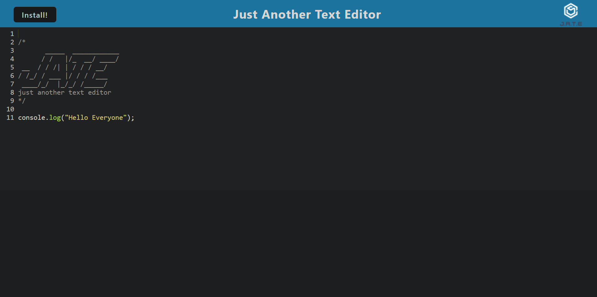

# PWA Text Editor

## Description
The purpose of this challenge is to create a text editor web browser application that functions with, and without, an internet connection. This application included starter code that was edited to include GET and PUT methods within an IndexedDB object store. In addition, this application uses service workers that can be created using workbox. This allows users to ensure static assets will be pre-cached when the web pages are loaded. It also makes use of webpack bundles in order to minimize the amount of server requests for our application. The `idb` package is used in conjunction as a wrapper for the IndexedDB API which provides various methods for data storage and retrieval. The inclusion of the IndexedDB allows the application to create database storage that persists even after a user has navigated away from the DOM window. As this application follows best practice for PWA design, when a user loads the application in their web browser they are provided with the option to install it as an icon on their desktop. 

## Screenshot

## Links
[GitHub Repo](http://https://github.com/sailorshy94/PWATxtEditor)
[Deployed App](http://)